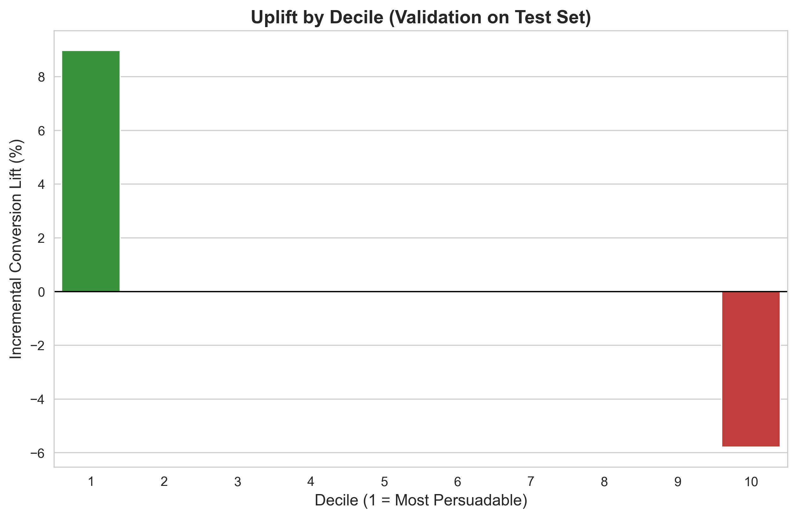

# 🚀 Causal Uplift Optimization Service

### *Optimizing Marketing ROI through Causal Inference and AI Agents*

**Deployment Status:**   

---

## 📖 Executive Summary & Use Case
**The Problem:** A retail business wants to launch an email marketing campaign. However, sending emails to *everyone* is inefficient. Some customers will buy regardless (waste of budget), while others might be annoyed and churn (negative value).

**The Solution:** Unlike traditional Machine Learning which asks *"Who is likely to buy?"*, this project solves a harder, more valuable problem: **"Who will be *influenced* to buy ONLY because of the email?"**

Using the **Kevin Hillstrom Email Marketing Dataset**, this application builds a **Causal Uplift Model** to distinguish between:
1.  **Persuadables:** Customers who only buy if emailed (The Target).
2.  **Sure Things:** Customers who buy even without the email (Do not waste budget).
3.  **Lost Causes:** Customers who won't buy regardless (Do not waste budget).
4.  **Sleeping Dogs:** Customers who react negatively if emailed (Avoid).

---

## 🧠 Why This Is NOT "Just Another Prediction Model"

Most data science projects use **Propensity Modeling** (Supervised Learning) to predict `P(Buy)`.
* *Flaw:* This targets loyal customers who are already buying, wasting marketing spend.

This project uses **Causal Inference (Uplift Modeling)**. We predict the **Incremental Lift**:
$$\text{Uplift} = P(\text{Buy} | \text{Treatment}) - P(\text{Buy} | \text{Control})$$

### The "Counterfactual" Challenge
In real life, we cannot observe two parallel universes—one where a customer got the email, and one where they didn't.
* **Technique Used:** I implemented **Meta-Learners (X-Learner)** using XGBoost to infer these unobserved counterfactuals and estimate the **Conditional Average Treatment Effect (CATE)**.

---

## 📊 Data Source

**Dataset:** [Kevin Hillstrom's MineThatData E-Mail Analytics And Data Mining Challenge](https://blog.minethatdata.com/2008/03/minethatdata-e-mail-analytics-and-data.html)

This dataset is highly regarded as a **Real-World Randomized Control Trial (RCT)**.

* **Modeled Subset:** **42,693 customers.**
    * *Filtering Logic:* I isolated the **Men's Merchandise Campaign** vs. **Control Group** to ensure a clear A/B test structure.
* **Features:** Historical customer behavior (Recency, Frequency, Monetary), zip code, and channel usage.
* **Challenge:** The data contains realistic class imbalance (conversion rates <1%) and noise, requiring robust feature engineering.

---

## 🤖 Machine Learning Solution

### The Approach: Calculating "Incremental Impact"
The goal was to predict how much *more* likely a specific customer is to buy if they receive an email, compared to if they are left alone.

I implemented **Causal Meta-Learners** to solve this:
1.  **Feature Engineering:** Processed customer history (RFM) and Channel usage to create robust user profiles.
2.  **Meta-Learner Strategy:** I trained models to estimate two potential outcomes (`P(Buy|Email)` and `P(Buy|No Email)`) and calculated the difference.
3.  **Champion Model:** I trained S-Learner, T-Learner, and X-Learner models. The **X-Learner (XGBoost)** was selected as the production model because it performed best on the imbalanced data.

---

## 🏆 Key Results & Business Impact

### 1. Validation on Test Data
The chart below shows the model's performance on the **Test Set (20% of data)**—customers the model had never seen before.

**How to Read This Chart:**
* **Green Bar (Left):** Positive impact. The email caused these people to buy.
* **Red Bar (Right):** Negative impact. The email caused these people *not* to buy.
* **Empty Middle:** No impact. The email didn't change their behavior.



### 2. Strategic Interpretation
The model clearly separated customers into three distinct strategy groups, optimizing the budget allocation:

* **Group 1: The "Persuadables" (Top 10%)**
    * **Result:** A massive **+9% boost** in sales when emailed.
    * **Strategy:** **TARGET AGGRESSIVELY.** This is the only group generating incremental revenue.

* **Group 2: The "Neutrals" (Middle 80%)**
    * **Result:** For the vast majority, the email made **zero difference**.
    * **Strategy:** **DO NOT EMAIL.** We can save 80% of the marketing budget by ignoring this group without losing any sales.

* **Group 3: The "Sleeping Dogs" (Bottom 10%)**
    * **Result:** Sending an email here actually **hurt sales (-6%)**.
    * **Strategy:** **AVOID COMPLETELY.** Suppressing this group prevents churn.

**Final Impact:** By targeting only the top 10%, the business captures the maximum revenue increase while reducing deployment costs by ~90%.

---

### ❓ Technical Note: Why No "Accuracy" or "F1-Score"?
Unlike traditional classification (e.g., Churn), **Uplift Modeling lacks "Ground Truth" labels.** We never know if a treated customer *would* have bought without treatment.
* **Metric Used:** Instead of Accuracy, I optimized for **AUUC (Area Under Uplift Curve)** and the **Qini Coefficient** to measure how well the model ranked persuadable customers.
* **Optimization:** The decision threshold was tuned to minimize "Sleeping Dogs" (Negative Uplift), treating them as the most critical error class.

---

## 🏗 System Architecture & MLOps

This project is engineered as a **Production-Grade MLOps System** designed for zero-touch deployment.

* **Containerization:** Packaged with **Docker** to ensure the complex Python environment runs identically across environments.
* **Infrastructure:** Hosted on **Azure App Service (Linux)**.
* **Artifact Management:** Images stored in **Azure Container Registry (ACR)**.
* **CI/CD:** Automated build and deployment pipeline via **GitHub Actions**.

### Deployment Workflow
The `.github/workflows/deploy.yaml` pipeline handles:
1.  **Push:** Code committed to `main` triggers the Action.
2.  **Build:** GitHub Runners build the Docker image.
3.  **Secure:** Credentials injected via GitHub Secrets (no hardcoded keys).
4.  **Deploy:** Azure App Service Webhook triggers an automatic pull of the new image.

*(Note: The live Azure instance may be paused to conserve cloud resources. Please use the local installation steps below.)*

---

## 🛠 Tech Stack

| Domain | Tools Used |
| :--- | :--- |
| **Machine Learning** | Python, CausalML, XGBoost, Scikit-Learn |
| **Web Interface** | Streamlit (Interactive Dashboard) |
| **Containerization** | Docker, Docker Compose |
| **Cloud Infrastructure** | Azure App Service, Azure Container Registry (ACR) |
| **CI/CD & DevOps** | GitHub Actions, YAML, Bash Scripting |

---

## 💻 How to Run Locally

### Option 1: Using Docker (Recommended)
*Ensures you have the exact environment used in production.*

```bash
# 1. Clone the repository
git clone https://github.com/Vinaykiran1819/Casual-Uplift-Optimization-Service.git

# 2. Build the Docker image
docker build -t causal-uplift-app .

# 3. Run the container
docker run -p 8501:8501 causal-uplift-app